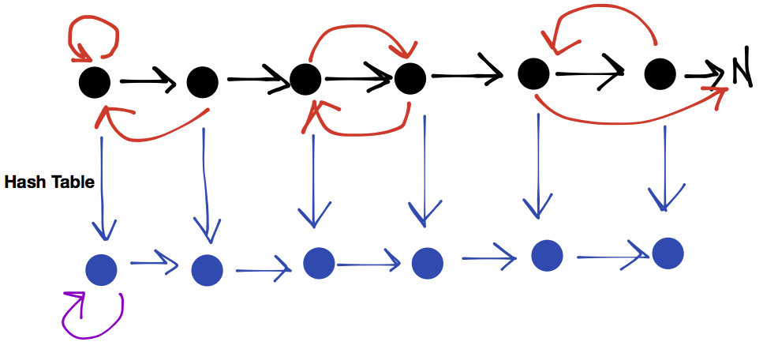
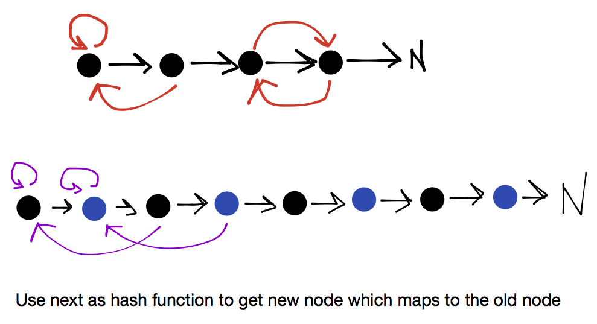

##Copy List with Random Pointer

A linked list is given such that each node contains an additional random pointer which could point to any node in the list or null.

Return a deep copy of the list.


**Method**:

1. Use HashMap - Works as well in **Clone Graph**

* Copy Linked List with **value** & **normal pointers**
* HashMap
  * Mapping bet. Old (**key**) & New (**value**) Nodes
  * Then used to assign **RandomPointer** value to each node



2. Without HashMap

* Copy List as 1->1'->2->2'->3->3'->4->4'->5->5'->NULL (next as hash function)
* Assign random pointers
* Split copied list into 2 sub lists




```java
//HashMap version
public class Solution {
    public RandomListNode copyRandomList(RandomListNode head) {
        if (head == null) {
            return null;
        }

        HashMap<RandomListNode, RandomListNode> map = new HashMap<RandomListNode, RandomListNode>();
      
        RandomListNode dummy = new RandomListNode(0);
        RandomListNode pre = dummy, newNode;
        while (head != null) {
            if (map.containsKey(head)) {
                newNode = map.get(head);
            } else {
                newNode = new RandomListNode(head.label);
                map.put(head, newNode);
            }
            pre.next = newNode;

            if (head.random != null) {
                if (map.containsKey(head.random)) {
                    newNode.random = map.get(head.random);
                } else {
                    newNode.random = new RandomListNode(head.random.label);
                    map.put(head.random, newNode.random);
                }
            }

            pre = newNode;
            head = head.next;
        }

        return dummy.next;
    }
}

/*第一遍扫的时候巧妙运用next指针， 开始数组是1->2->3->4  。 然后扫描过程中 先建立copy节点 1->1`->2->2`->3->3`->4->4`, 然后第二遍copy的时候去建立边的copy， 拆分节点, 一边扫描一边拆成两个链表，这里用到两个dummy node。第一个链表变回  1->2->3 , 然后第二变成 1`->2`->3`  */
//No HashMap version
public class Solution {
    private void copyNext(RandomListNode head) {
        while (head != null) {
            RandomListNode newNode = new RandomListNode(head.label);
            newNode.random = head.random;
            newNode.next = head.next;
            head.next = newNode;
            head = head.next.next;
        }
    }

    private void copyRandom(RandomListNode head) {
        while (head != null) {
            if (head.next.random != null) {
                head.next.random = head.random.next;
            }
            head = head.next.next;
        }
    }

    private RandomListNode splitList(RandomListNode head) {
        RandomListNode newHead = head.next;
        while (head != null) {
            RandomListNode temp = head.next;
            head.next = temp.next;
            head = head.next;
            if (temp.next != null) {
                temp.next = temp.next.next;
            }
        }
        return newHead;
    }

    public RandomListNode copyRandomList(RandomListNode head) {
        if (head == null) {
            return null;
        }
        copyNext(head);
        copyRandom(head);
        return splitList(head);
    }
}
```


```java
public class Solution {
    /**
     * @param head: The head of linked list with a random pointer.
     * @return: A new head of a deep copy of the list.
     */
    public RandomListNode copyRandomList(RandomListNode head) {
        // write your code here
        
        // HashMap
        Map<RandomListNode, RandomListNode> map = 
            new HashMap<RandomListNode, RandomListNode>();
            
            
        RandomListNode dummy = new RandomListNode(0);
        
        RandomListNode pre = dummy;
        
        
        // label & next
        while (head != null) {
            
            RandomListNode node = new RandomListNode(head.label);
            pre.next = node;
            
            map.put(head, node);
            
            head = head.next; // old list
            pre = node; // new list
        }
        
        // random
        for (Map.Entry<RandomListNode, RandomListNode> entry :
            map.entrySet()) {
            
            RandomListNode oldNode = entry.getKey();        
            RandomListNode newNode = entry.getValue();
            
            newNode.random = map.get(oldNode.random);
        }
        
        return dummy.next;
        
    }
}
```


