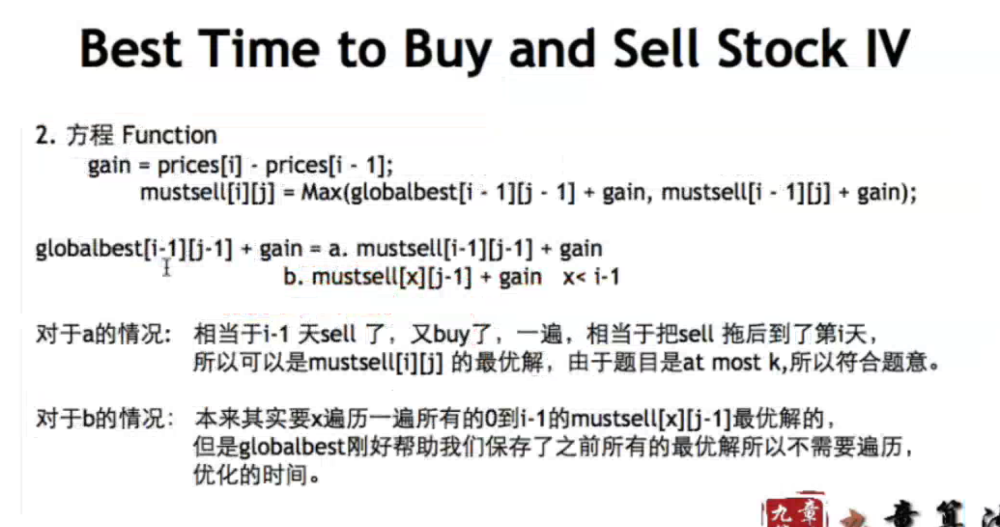

###Best Time to Buy and Sell Stock I

https://leetcode.com/problems/best-time-to-buy-and-sell-stock/description/

Say you have an array for which the *i*th element is the price of a given stock on day *i*.

If you were only permitted to complete at most one transaction (ie, buy one and sell one share of the stock), design an algorithm to find the maximum profit.

**Example 1:**

```
Input: [7, 1, 5, 3, 6, 4]
Output: 5

max. difference = 6-1 = 5 (not 7-1 = 6, as selling price needs to be larger than buying price)

```

**Example 2:**

```
Input: [7, 6, 4, 3, 1]
Output: 0

In this case, no transaction is done, i.e. max profit = 0.
```


```java
class Solution {
    public int maxProfit(int[] prices) {
        if (prices == null || prices.length == 0) {
            return 0;
        }
        
        int[] dp = new int[prices.length];
        
        // dp[i]: In the first i days, max profit
        dp[0] = 0;
        int min = prices[0];
        
        for (int i = 1; i < prices.length; i++) {
            dp[i] = Math.max(dp[i - 1], prices[i] - min);
            min = Math.min(min, prices[i]);
        }
        
        return dp[prices.length - 1];
    }
}
```

* Space Optimization

```java
class Solution {
    public int maxProfit(int[] prices) {
        if (prices == null || prices.length == 0) {
            return 0;
        }
        
        
        // dp[i]: In the first i days, max profit
        int min = prices[0];
        int profit = 0;
        
        for (int i = 1; i < prices.length; i++) {
            profit = Math.max(profit, prices[i] - min); 
            min = Math.min(min, prices[i]);
        }
        
        return profit;
    }
}
```


###Best Time to Buy and Sell Stock II

https://leetcode.com/problems/best-time-to-buy-and-sell-stock-ii/description/

Say you have an array for which the *i*th element is the price of a given stock on day *i*.

Design an algorithm to find the maximum profit. You may **complete as many transactions as you like** (ie, buy one and sell one share of the stock multiple times). However, you may not engage in multiple transactions at the same time (ie, you must sell the stock before you buy again).


* "buy one and sell one share of the stock" **multiple times**
* must sell the stock before you buy again

```java
class Solution {
    public int maxProfit(int[] prices) {
        
        int profit = 0;
        // Greedy
        for (int i = 1; i < prices.length; i++) {
            if (prices[i] > prices[i - 1]) {
                profit += prices[i] - prices[i - 1];
            }
        }
        
        return profit;
    }
}
```


###Best Time to Buy and Sell Stock III

https://leetcode.com/problems/best-time-to-buy-and-sell-stock-iii/description/

Say you have an array for which the *i*th element is the price of a given stock on day *i*.

Design an algorithm to find the maximum profit. You may complete at most ***two*** transactions.

**Note:**
You may not engage in multiple transactions at the same time (ie, you must sell the stock before you buy again).


```java


```


### Best Time to Buy and Sell Stock IV

https://leetcode.com/problems/best-time-to-buy-and-sell-stock-iv/description/

Say you have an array for which the *i*th element is the price of a given stock on day *i*.

Design an algorithm to find the maximum **profit**. You may complete at most **k** transactions.


* State: 
  * mustSell[i]-[j] 前i天，至多进行j次交易，第i天必须sell的最大收益
  * globalBest[i]-[j] 前i天，至多进行j次交易，第i天可以不sell的最大收益
* function: 
  * gain = prices[i] - prices[i-1] (今天的交易)
  * mustSell[i].[j] = Max(globalBest[i-1].[j-1] + gain, mustSell[i-1].[j] + gain);
  * globalBest[i].[j] =Max(mustSell[i].[j], globalBest[i-1].[j]);
* answer: f[n-1].[k]
* initialize: f[i].[0] = 0, f[0].[i]= -MAXINT




```java
class Solution {
    public int maxProfit(int k, int[] prices) {
        if (prices == null || prices.length == 0) {
            return 0;
        }
        
        int n = prices.length;
        
		if (k >= n / 2) { // pitfall !!
            int profit = 0;
            for (int i = 1; i < prices.length; i++) {
                if (prices[i] > prices[i - 1]) {
                    profit += prices[i] - prices[i - 1];
                }
            }
            return profit;
        }
      
        int[][] mustSell = new int[n][k + 1];
        int[][] globalBest = new int[n][k + 1];
        
        mustSell[0][0] = globalBest[0][0] = 0;
        
        // 1st row
        for (int i = 1; i <= k; i++) {
            mustSell[0][i] = globalBest[0][i] = 0;
        }
        
        for (int i = 1; i < n; i++) {
            int gainOrLose = prices[i] - prices[i - 1];
            mustSell[i][0] = 0; // 1st col
            
            for (int j = 1; j <= k; j++) {
                mustSell[i][j] = Math.max(globalBest[i - 1][j - 1] + gainOrLose,
                                         mustSell[i - 1][j] + gainOrLose);
                    
                globalBest[i][j] = Math.max(globalBest[i - 1][j], mustSell[i][j]);
            }
        }
        
        return globalBest[n - 1][k];
    }
}

```

```java
class Solution {
    public int maxProfit(int k, int[] prices) {
        if (prices == null || prices.length == 0) {
            return 0;
        }
        
        int n = prices.length;
        
        if (k >= n / 2) { // pitfall !!
            int profit = 0;
            for (int i = 1; i < prices.length; i++) {
                if (prices[i] > prices[i - 1]) {
                    profit += prices[i] - prices[i - 1];
                }
            }
            return profit;
        }
      
        int[] mustSell = new int[k + 1];
        int[] globalBest = new int[k + 1];
        
        for (int i = 1; i < n; i++) {
            int gainOrLose = prices[i] - prices[i - 1];
            
            for (int j = k; j > 0; j--) { 
                // reverse order - cannot space-optimize further - dependencies
                mustSell[j] = Math.max(globalBest[j - 1] + gainOrLose,
                                         mustSell[j] + gainOrLose);
                    
                globalBest[j] = Math.max(globalBest[j], mustSell[j]);
            }
        }
        
        return globalBest[k];
    }
}
```


