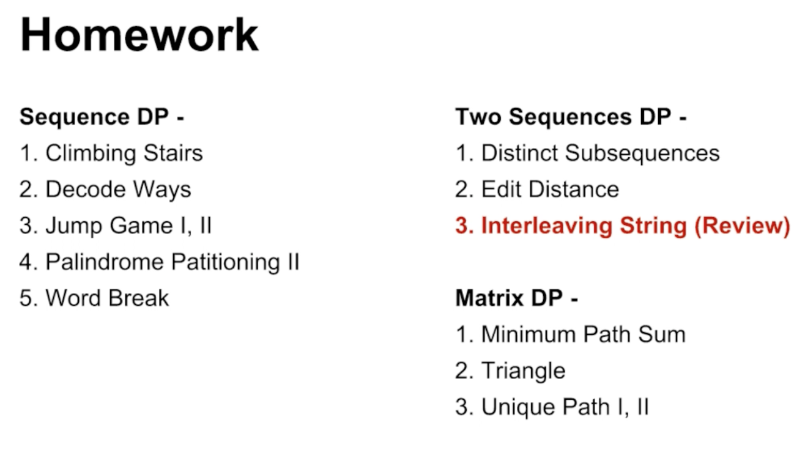

## Content - Dynamic Programming

**Warm Up!**

* [Climbing Stairs](70. Climbing Stairs.md)
* [Triangle](120. Triangle.md)

**DFS** - ${O(2^n)}$

* Find out all possibilities 

**DP** - ${O(n^2)}$

* Memorized Search Basically
* Top-down/Bottom-up
* Iteration/Recursion
* Unnecessary to get all possibilities
  * Minimum/Maximum
  * Count of solutions
  * Possibility


**What is DP?  - 本质**

* Memorize **Search** 记忆化搜索
* dfs(..): 当前状态到最终状态的一个值，并记忆下来
* **Advantage**: easy to think and implement
* **Disadvanatage**: expensieve **memoy cost** 


**Four Types of DP**

* Matrix DP

  * [Unique Paths I & II ](62. Unique Paths.md)
  * 过河卒 http://wikioi.com/problem/1010/
  * [Triangle](120. Triangle.md)
  * [Minimum Path Sum](64. Minimum Path Sum.md)

* Sequence DP (先枚举区间长度，再枚举区间起点，因要按照区间从小到大进行枚举)

  * [Climbing Stairs](70. Climbing Stairs.md)

  * **Decode Ways**

  * [Jump Game I, II](55. Jump Game.md)

  * [Palindrome Partitioning II](131. Palindrome Partitioning.md)

  * [Word Break I](139. Word Break.md)

  * [!!!!! Longest Increasing Subsequence](Longest Increasing Subsequence.md)

    ```java
    // f[i]：(代表前i个数，并且第i个数是LIS中最后一个数的) 最长LIS的长度
    for (int i = 0; i < n; i++) {
        for (int j = ; j < i; j++) {
            if (a[i] >= a[j]) {
                f[i] = max(f[i], f[j] + 1);
            }
        }
    }
    ```

    ​

* Two Sequences DP

  * [Distinct Subsequence](115. Distinct Subsequences.md)
  * [Edit Distance](72. Edit Distance.md)
  * [Interleaving String](97. Interleaving String.md)
  * [Longest Common Subsequence](Lint. Longest Common Subsequence.md)

* Interval DP (rare in interview)



**Clues - 如何想到使用DP**

- Find a **maximum**/**minimum** result
- Decide whether something is **possible** or not
- **Count** all possible solutions
  -  Problem doesn't care about solution details, only care about the count or possibility


**How - 怎样尝试DP**

- Try forward
- Try backward


**动态规划的要素**

1. status - 状态

   1. Questions
      1. Maximum/Minimum
      2. Yes/No
      3. Count(*)
   2. Category
      1. MatrixDP: ${f[i][j]}$ - 从1,1走到i,j *** (optimal, count, possible)
      2. SequenceDP: ${f[i]}$ - 前i个 ***
      3. 2SequenceDP: ${f[i][j]}$ - 前i个匹配到前j个 ***
      4. Interval: ${f[i][j]}$ - 表示区间i-j ***

2. transfer/functioin - 状态之间的联系，通过小状态，求得大状态

   1. LCS: ${f[i][j] = max(f[i-1][j], f[i][j-1], f[i-1][j-1] + 1)}$
   2. LIS: ${f[i] = max(f[j] + 1, f[i])}$, if ${a[i] >(=) a[j]}$

   * 分析最后一次划分／最后一个字符／最后 ***

3. initialize - 最极限的小状态是什么，起点 

   1. ${f[i][0], f[0][i]}$ 
   2. ${f[0][0]}$
   3. LIS: ${f[1…n] = 1;}$
   4. LCS: 

4. answer - 最大的状态是什么，终点 

   1. LIS: ${max(f[i])}$
   2. LCS: ${f[n][m]}$

   * Note - f[i] 可能表示第i个的状态 或者 前i个的状态

5. loop

   1. Inverval: 区间从小到大，先枚举区间长度，Palindrome Partitioning II


**动态规划的空间优化**

[House Robber](House Robber.md)

[Maximal Square](221. Maximal Square.md)

**动态规划的局部最优和全局最优实现时间优化**

[Maximum Subarray & Maximum Product Subarray](../Linear-Structure/53. Maximum Subarray.md)

**动态规划的记忆化搜索** - 解决重复计算的搜索

* 循环 - <u>从小到大</u>递推
  * for loop
* **记忆化搜索** - <u>从大到小</u>搜索
  * use matrix for memorization

[Longest Continuous Increasing Subsequence I & II](../Linear-Structure/674. Longest Continuous Increasing Subsequence.md)

[Coins in a Line]

什么时候使用记忆化搜索？（for-loop解决不了，使用记忆搜索）

* 状态转移特别麻烦，不是顺序性
* 初始化状态不易得出

```java
// 循环求所有状态
for i = 1 ->n 
	dp[i] = search(i)

// 搜索
int search(i) {
    if (visit[i] == 1)
        return dp[i];
	if (smallest state) {
        set smallest state
    } else {
        // to update(i), we might need other state
        // such as (i - 1), (i + 1)
        for other state
          update dp[i] = max(search(i - 1), search(i + 1))
    }
    visit[i] = 1;
    return dp[i];
}

```


###**Summary**:

空间优化

* 重点：滚动数组 （序列型动态规划都可用；记忆化搜索则不能使用）

局部最优和全局最优实现时间优化

* 重点：global 和 local 实现时间优化（需要求前i个的最值，可使用global&local数组辅助存储）

记忆化搜索

* 博弈类问题


**Overview**

* 博弈类 - 记忆化搜索
* 区间类 - 记忆化搜索
* 背包类


