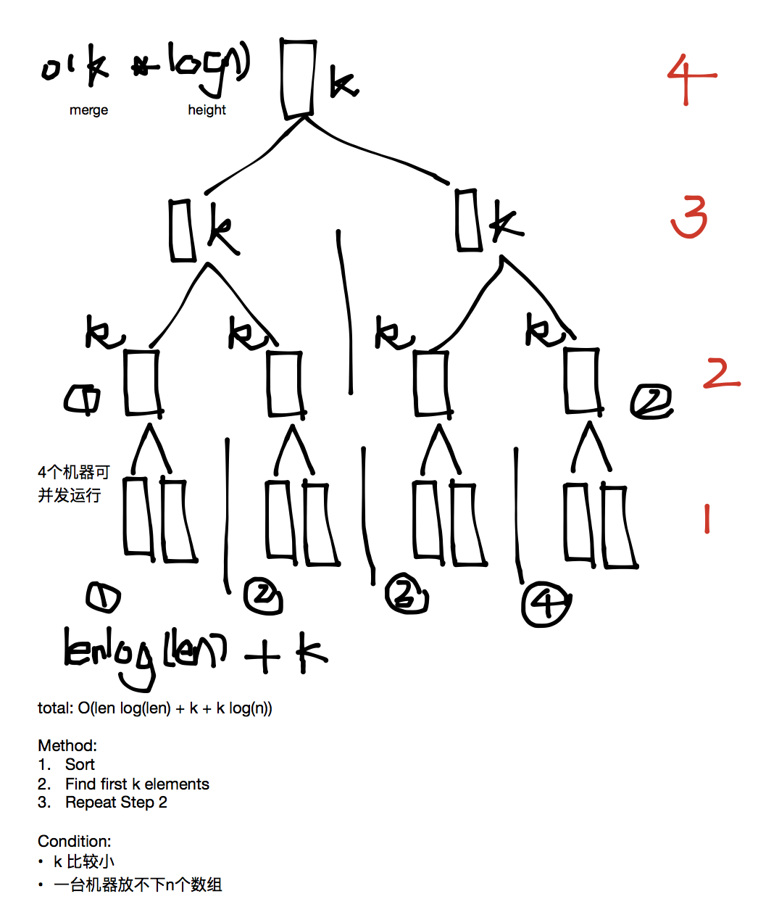
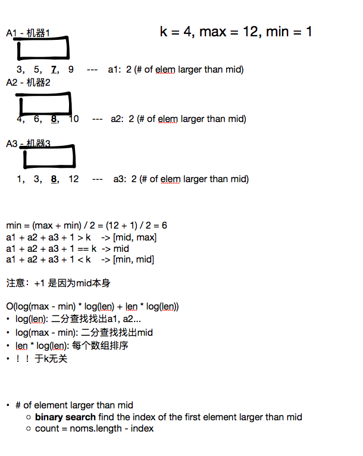
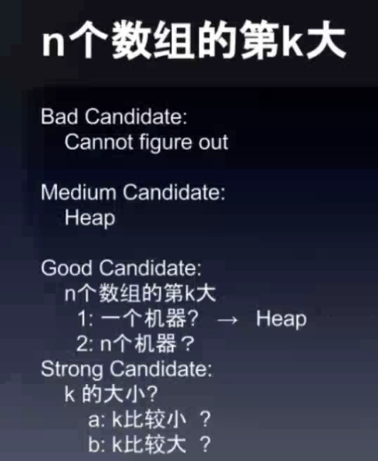
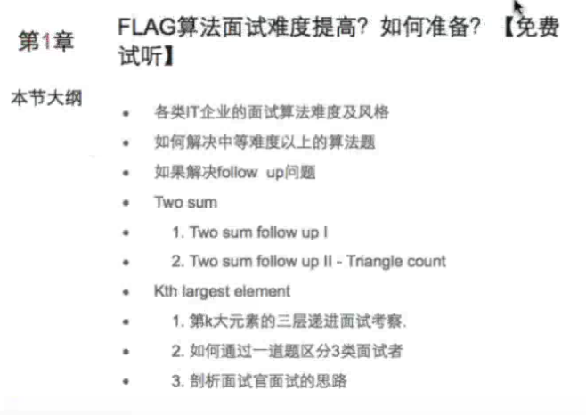
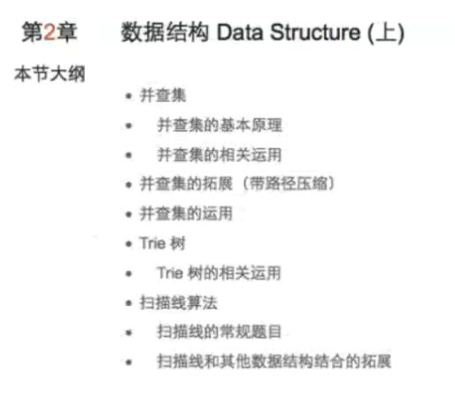
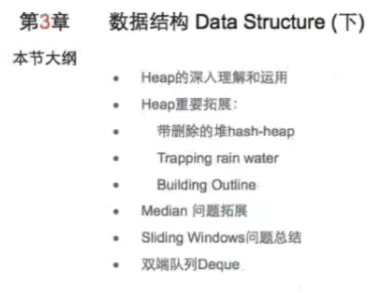
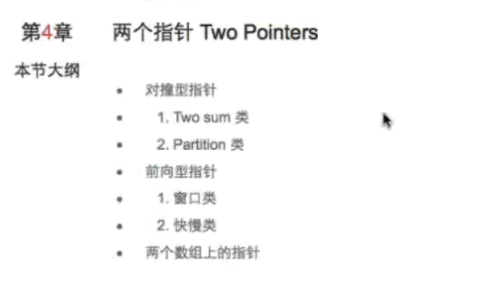
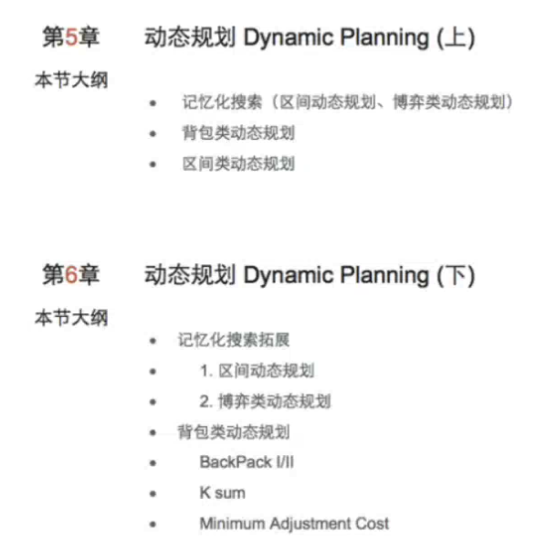
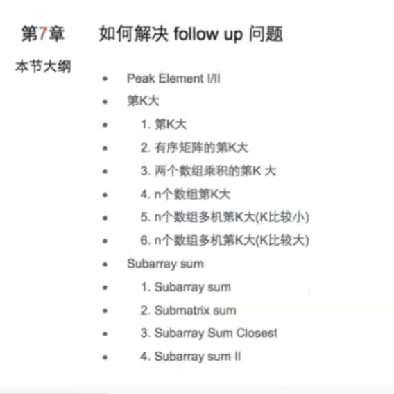
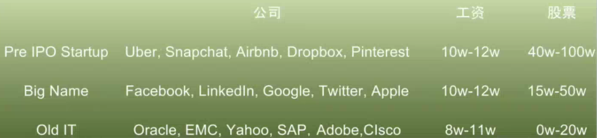

**Follow up:**

* [Two Sum I, II](2Sum.md)
* [Triangle Count](Lint. Triangle Count.md)

 这一类题目思路

**Two Sum**

* if (考虑A[i]和A[j]满足某个条件 > target)
  * do something
  * j—   **// 不用考虑[i+1, j-1] 和 j 组成的pairs 因这些也满足该条件** 
* else if (考虑A[i]和A[j]满足不某个条件 < target)
  * do something
  * i++  **// 不用考虑i 和 [i+1, j-1] 组成的pairs 因这些也不满足该条件**
* else (== target)
  * do something
  * i++ or j--

这一类通过对撞型指针优化算法，根本上是证明不用扫描多余状态

###对撞型指针题目

**2 Sum类 **(通过判断条件优化算法)

* 2 Sum II
* 3 Sum Closest
* 3 Sum
* 4 Sum
* k Sum
* Triangle Count
* Trapping Rain Water
* Container With Most Water

**Partition类**

* Partition Array
* Sort Colors
* Partition Array by Odd and Een
* Sort Letters by Case
* Valid Palindrome

###给n个非排序数组要求其中第k大的元素

* 第一层：
  * sort + heap
    * ${O(n * lenlog_2len + klog_2n)}$
* 第二层：
  * requirements
    * k比较**小**
    * 数组太大，一个机器放不下
  * ${O(klog_2n)}$: k is coeffiecint. If too large, time too large
* 第三层
  * requirements
    - k比较**大**
    - 数组太大，一个机器放不下

**Content of This Course:**

* **Companies**

* Work

[6 Ways to Manage your Indian Boss](https://www.slideshare.net/UpendraKartik/6-ways-to-manage-your-indian-boss#btnNext)

* Graph
  * **并查集** （图的变形）

* **Q & A**

 

