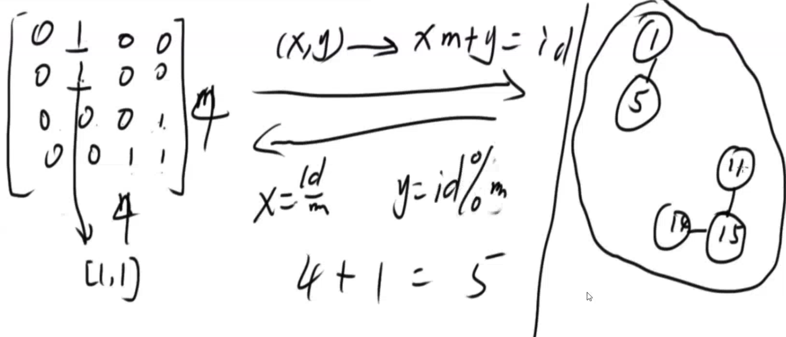
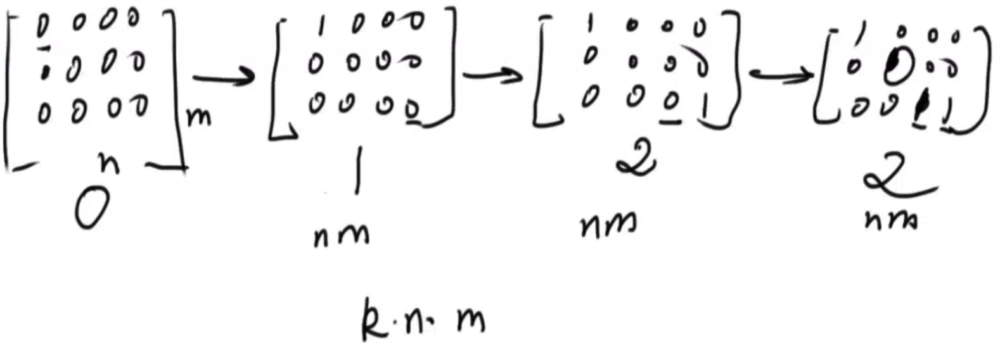

## Number of Islands I

https://leetcode.com/problems/number-of-islands/description/

Given a 2d grid map of `'1'`s (land) and `'0'`s (water), count the number of islands. An island is surrounded by water and is formed by connecting adjacent lands horizontally or vertically. You may assume all four edges of the grid are all surrounded by water.

**Example 1:**

```
11110
11010
11000
00000
```

Answer: 1

**Example 2:**

```
11000
11000
00100
00011
```

Answer: 3


**Trick**:

2 dimension -> 1 dimension

id = xm + y (x, y)

1 dimension -> 2 dimension

x = id /  m, y = id % y




**Method**: same with [Find the Connected Component in the Undirected Graph](Find the Connected Component in the Undirected Graph.md)

* BFS
* DFS

```java
// version 1: BFS
class Coordinate {
    int x, y;
    public Coordinate(int x, int y) {
        this.x = x;
        this.y = y;
    }
}

public class Solution {
    /**
     * @param grid a boolean 2D matrix
     * @return an integer
     */
    public int numIslands(boolean[][] grid) {
        if (grid == null || grid.length == 0 || grid[0].length == 0) {
            return 0;
        }
        
        int n = grid.length;
        int m = grid[0].length;
        int islands = 0;
        
        for (int i = 0; i < n; i++) {
            for (int j = 0; j < m; j++) {
                if (grid[i][j]) {
                    markByBFS(grid, i, j);
                    islands++;
                }
            }
        }
        
        return islands;
    }
    
    private void markByBFS(boolean[][] grid, int x, int y) {
        // magic numbers!
        int[] directionX = {0, 1, -1, 0};
        int[] directionY = {1, 0, 0, -1};
        
        Queue<Coordinate> queue = new LinkedList<>();
        
        queue.offer(new Coordinate(x, y));
        grid[x][y] = false;
        
        while (!queue.isEmpty()) {
            Coordinate coor = queue.poll();
            for (int i = 0; i < 4; i++) {
                Coordinate adj = new Coordinate(
                    coor.x + directionX[i],
                    coor.y + directionY[i]
                );
                if (!inBound(adj, grid)) {
                    continue;
                }
                if (grid[adj.x][adj.y]) {
                    grid[adj.x][adj.y] = false;
                    queue.offer(adj);
                }
            }
        }
    }
    
    private boolean inBound(Coordinate coor, boolean[][] grid) {
        int n = grid.length;
        int m = grid[0].length;
        
        return coor.x >= 0 && coor.x < n && coor.y >= 0 && coor.y < m;
    }
}

// version 2: Union Find
class UnionFind { // make it general instead of being specific
  HashMap<Integer, Integer> fathers = null;
  int count;

  public UnionFind(int n) {
    fathers = new HashMap<Integer, Integer>();
    for (int i = 0; i < n; i++) {
      fathers.put(i, i);
    }
  }

  public int compressed_find(int x) {
    // find root of node x (parent)
    int parent = x;
    while (parent != fathers.get(parent)) {
      parent = fathers.get(parent);
    }

    // compress route for all nodes from x until parent
    int temp = -1;
    int fa = x;
    while (fa != fathers.get(fa)) {
      temp = fathers.get(fa);
      fathers.put(fa, parent);

      fa = temp;
    }

    return parent;
  }

  public void union(int x, int y) {
    int fa_x = compressed_find(x);    
    int fa_y = compressed_find(y);

    if (fa_x != fa_y) {
      fathers.put(fa_x, fa_y);
      count--;
    }
  }

  public int query() {
    return count;
  }

  public void set_count(int total) {
    count = total;
  }
}

public class Solution {    
    int row = 0;
    int col = 0;
    
    public int numIslands(char[][] grid) {
        if (grid == null || grid.length == 0) {
            return 0;
        }
        if (grid[0] == null || grid[0].length == 0) {
            return 0;
        }
        
        row = grid.length;
        col = grid[0].length;

        // initialize uf
        UnionFind uf = new UnionFind(row * col);
        int total = 0;
        for(int i = 0;i < grid.length; ++i) {
            for(int j = 0;j < grid[0].length; ++j) {
                if (grid[i][j] == '1') {
                    total++;
                }
            }
        }
        uf.set_count(total);
        
        // traverse
        for (int i = 0; i < row; i++) {
            for (int j = 0; j < col; j++) {
                // only care about '1'
                if (grid[i][j] != '1') {
                    continue;
                }
                
                connect(grid, uf, i, j, i - 1, j);
                connect(grid, uf, i, j, i + 1, j);
                connect(grid, uf, i, j, i, j - 1);
                connect(grid, uf, i, j, i, j + 1);
            }
        }
        
        return uf.query();
    }
    
    private void connect(char[][] grid, UnionFind uf, int x, int y, int i, int j) {
        if (i >= 0 && i < row && j >= 0 && j < col && grid[i][j] == '1') {
            uf.union(x * col + y, i * col + j);
        }
    }
}

class UnionFind { 

    private int[] father = null;
    private int count;

    private int find(int x) {
        if (father[x] == x) {
            return x;
        }
        return father[x] = find(father[x]);
    }

    public UnionFind(int n) {
        // initialize your data structure here.
        father = new int[n];
        for (int i = 0; i < n; ++i) {
            father[i] = i;
        }
    }

    public void connect(int a, int b) {
        // Write your code here
        int root_a = find(a);
        int root_b = find(b);
        if (root_a != root_b) {
            father[root_a] = root_b;
            count --;
        }
    }
        
    public int query() {
        // Write your code here
        return count;
    }
    
    public void set_count(int total) {
        count = total;
    }
}

public class Solution {
    /**
     * @param grid a boolean 2D matrix
     * @return an integer
     */
    public int numIslands(boolean[][] grid) {
        int count = 0;
        int n = grid.length;
        if (n == 0)
            return 0;
        int m = grid[0].length;
        if (m == 0)
            return 0;
        UnionFind union_find = new UnionFind(n * m);
        
        int total = 0;
        for(int i = 0;i < grid.length; ++i)
            for(int j = 0;j < grid[0].length; ++j)
            if (grid[i][j])
                total ++;
    
        union_find.set_count(total);
        for(int i = 0;i < grid.length; ++i)
            for(int j = 0;j < grid[0].length; ++j)
            if (grid[i][j]) {
                if (i > 0 && grid[i - 1][j]) {
                    union_find.connect(i * m + j, (i - 1) * m + j);
                }
                if (i <  n - 1 && grid[i + 1][j]) {
                    union_find.connect(i * m + j, (i + 1) * m + j);
                }
                if (j > 0 && grid[i][j - 1]) {
                    union_find.connect(i * m + j, i * m + j - 1);
                }
                if (j < m - 1 && grid[i][j + 1]) {
                    union_find.connect(i * m + j, i * m + j + 1);
                }
            }
        return union_find.query();
    }
}


// version 3: DFS (not recommended)
public class Solution {
    /**
     * @param grid a boolean 2D matrix
     * @return an integer
     */
    private int m, n;
    public void dfs(boolean[][] grid, int i, int j) {
        if (i < 0 || i >= m || j < 0 || j >= n) return;
        
        if (grid[i][j]) {
            grid[i][j] = false;
            dfs(grid, i - 1, j);
            dfs(grid, i + 1, j);
            dfs(grid, i, j - 1);
            dfs(grid, i, j + 1);
        }
    }

    public int numIslands(boolean[][] grid) {
        // Write your code here
        m = grid.length;
        if (m == 0) return 0;
        n = grid[0].length;
        if (n == 0) return 0;
        
        int ans = 0;
        for (int i = 0; i < m; i++) {
            for (int j = 0; j < n; j++) {
                if (!grid[i][j]) continue;
                ans++;
                dfs(grid, i, j);
            }
        }
        return ans;
    }
}
```


##Number of Islands II

https://zhengyang2015.gitbooks.io/lintcode/number_of_islands_ii_434.html

Given a n,m which means the row and column of the 2D matrix and an array of pair A( size k). Originally, the 2D matrix is all 0 which means there is only sea in the matrix. The list pair has k operator and each operator has two integer A[i].x, A[i].y means that you can change the grid matrix[A[i].x][A[i].y] from sea to island. Return how many island are there in the matrix after each operator.

Notice

0 is represented as the sea, 1 is represented as the island. If two 1 is adjacent, we consider them in the same island. We only consider up/down/left/right adjacent.

Example

Given n = 3, m = 3, array of pair A = [(0,0),(0,1),(2,2),(2,1)].

return [1,1,2,2].


**Methods**

* BFS/DFS



${O(k* nm)}$

* Union-Find

${O(k * 1 * 4)}$

* 1: every stage, only 1 position changing from sea to island (should talk with interviewer)
* 4: all 4 directions (left, top, right, bottom), and union takes $O(1)$


```java


```


