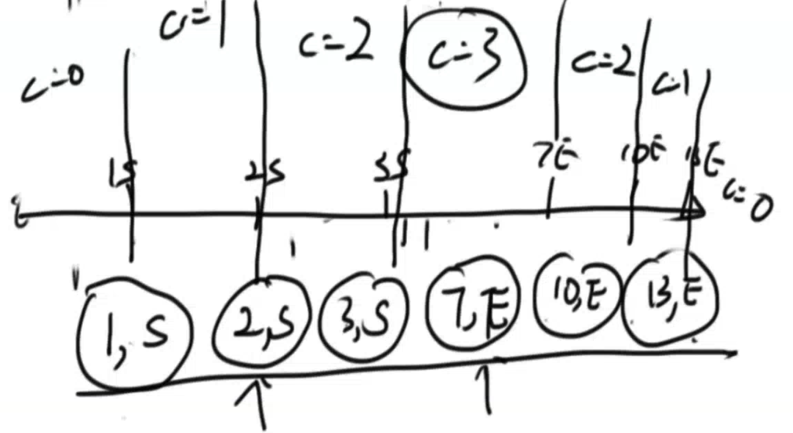

##Number of Airplanes in the Sky

http://www.lintcode.com/en/problem/number-of-airplanes-in-the-sky/

Given an interval list which are flying and landing time of the flight. **How many** airplanes are on the sky **at most**?

##### Notice

If landing and flying happens at the same time, we consider landing should happen at first.

**Example**

For interval list

```
[
  [1,10],
  [2,3],
  [5,8],
  [4,7]
]

```

Return `3`





```java
/**
 * Definition of Interval:
 * public classs Interval {
 *     int start, end;
 *     Interval(int start, int end) {
 *         this.start = start;
 *         this.end = end;
 *     }
 */

class Point {
    int time; // 
    int flag; // start > end
    
    Point(int t, int f) {
        this.time = t;
        this.flag = f;
    }
    
    // This is a statement !!!! end with ;
    public static Comparator<Point> PointComparator = new Comparator<Point>() {
        // anonymous class
        
        // implement compare
        public int compare(Point p1, Point p2) {
            if (p1.time == p2.time) {
                return p1.flag - p2.flag; // start > end !!!
            } else {
                return p1.time - p2.time;
            }
        }
    };
}

public class Solution {
    /*
     * @param airplanes: An interval array
     * @return: Count of airplanes are in the sky.
     */
    public int countOfAirplanes(List<Interval> airplanes) {
        // write your code here
        List<Point> list = new ArrayList<Point>(airplanes.size() * 2);
        for (Interval airplane : airplanes) {
            list.add(new Point(airplane.start, 1));
            list.add(new Point(airplane.end, 0));
        }
        
        Collections.sort(list, Point.PointComparator);
        int count = 0, ans = 0;
        for (Point p : list) {
            if (p.flag == 1) {
                count++; 
                ans = Math.max(ans, count);
            } else {
                count--;
            }
        }
        return ans;
    }
}
```


