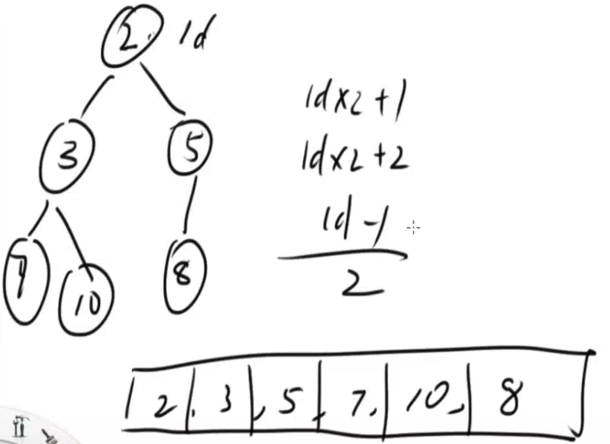
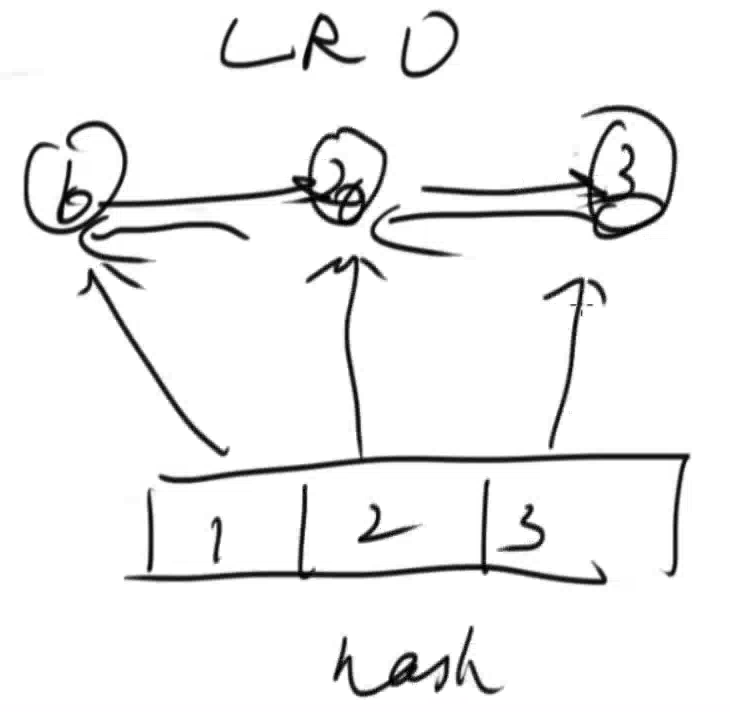
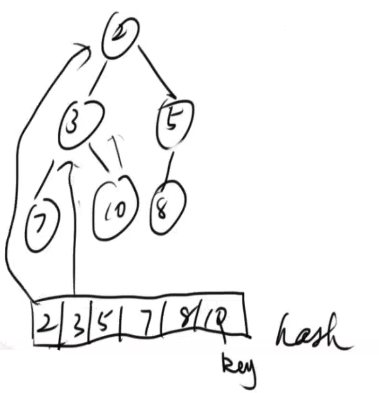

**Overview**

* Heap

  * Binary Heap (can be implemented by ArrayList - dynamic array in Java)
    * **push**/add a val
      * add to the last position of an array
      * last element **sift up** to proper position to maintain the properties of binary heap
    * **pop**/delete max or min
      * swap the first A & last B elements
      * length/size--
      * top element B **sift down** to proper position to maintain the properties of binary heap
    * **remove** any element
      * find the element by traversing $O(n)$
      * swap target element A & last element B
      * length/size--
      * **sift up or sift down** element B by comparing B with its parent & children $O(log_2n)$
    * **top**: $O(1)$
    * Parent: id —> Children: id x 2 + 1, id x 2 + 2
    * Child: id —> Parent: (id - 1) / 2

  

  * Hash Heap (用空间换时间)

    * 性质和形状
    * APIs:
      * **add/push** - $O(log_2n)$
      * **remove** - $O(log_2n)$
        * Find element: $O(1)$ using HashMap (**key**: node value, **value**: corresponding object in heap)
      * **pop** - $O(log_2n)$
      * **top** - $O(1)$
    * 如何处理重复元素
      * one more property for node object in heap: count
        * For example as below, add another 5 to the heap, Node(val = 5; count = 2)
    * LRU?
      * **LinkedHashMap** - similar to **HashHeap**
        * doubly linked list & hash map
        * Use hashmap to ***search*** quickly target element $O(1)$, also can speed up ***delete (search first)*** 

    

  

[Trapping Rain Water](42. Trapping Rain Water.md)

[Building Outline](Lint. Building Outline.md) - **Hash Heap**

[Find Median from Data Stream](295. Find Median from Data Stream.md)

[Data Stream Median & Sliding Window Median](Lint. Data Stream Median.md)

* 难点在于，拆解sliding window的移动过程，和处理三元组

!! 面试时需要实现HashHeap么？

* 跟面试官交流，让他明白你知道HashHeap以及它的原理和性质
* 面试时，面试官会让你使用priority queue代替hash heap

**Summary:**

How to get idea from the problem that we have solved previously?

* such as median and hashheap

* **Deque**
  * **Queue**: 吃了又拉
  * **Stack**: 吃了又吐
  * **Deque**: 
  * [Sliding Window Maximum](239. Sliding Window Maximum.md)

**灌水问题 (1-d & 2-d)**

* 从外面往里面灌水

**Windows Problem**

- 拆解分析
  - 加一个数，删一个数
- 求Median —> Heap —> 集合最值
- 求Max —> Deque —> 两端push, pop

**Summary**

* 学会通过做过的问题去解决新问题
* Deque: 两端都有push & pop
* Heap: 求集合的最大值

