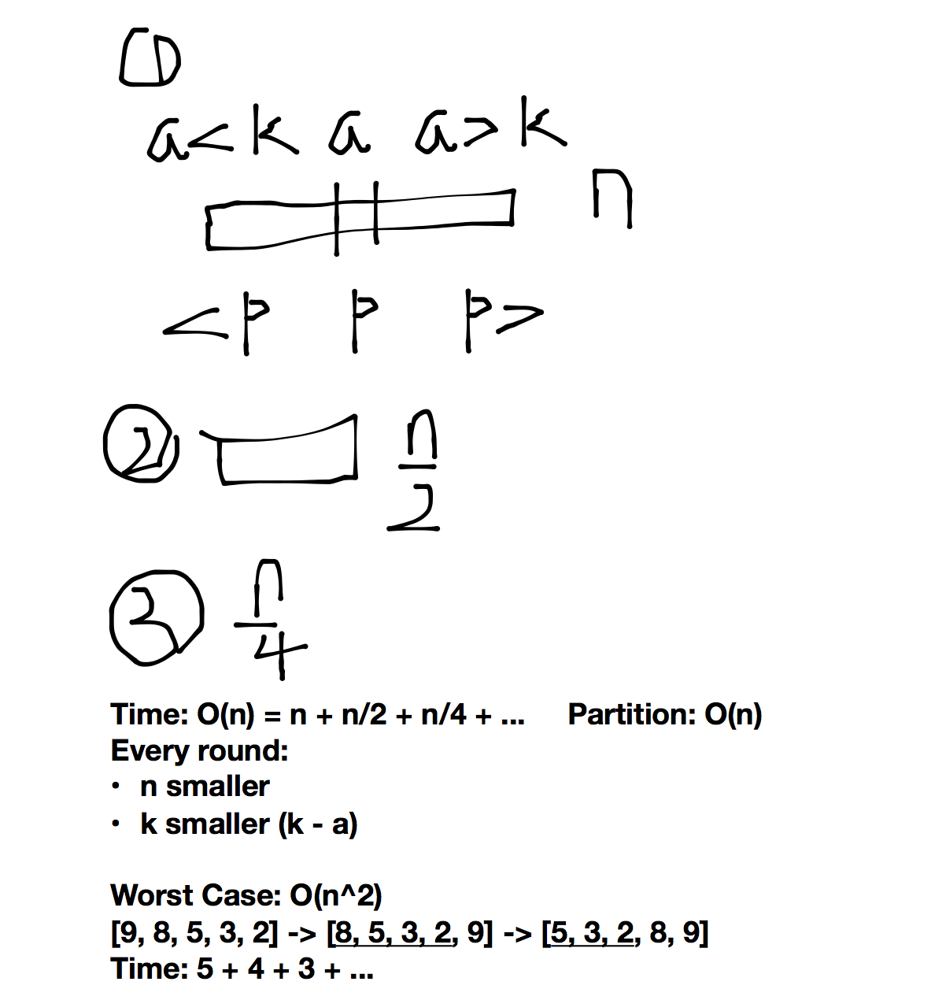

##Kth Largest Element in an Array

Find the **k**th largest element in an unsorted array. Note that it is the kth largest element in the sorted order, not the kth distinct element.

For example,
Given `[3,2,1,5,6,4]` and k = 2, return 5.

**Note: **
You may assume k is always valid, 1 ≤ k ≤ array's length.


**Methods**

1. **Heap 求最值**
   * Time
     * Traverse $O(n)$
     * Pop $O(klog_2 n)$
   * Space
     * $O(n)$
2. **Two Pointers**
   * Time
     * $O(n)$
   * Space
     * $O(1)$

[8, 4, 5, 3, 9] - Find 2nd largest elem

* pivot = 8 (1st value)
* expected results: [3, 4, 5, temp, 9]
* start from right to find 1st smaller elem (compared with pivot) 
* swap temp & found elem
* start from left to find 1st larger elem (compared with pivot)
* util left == right
* nums[left] = pivot
* index left (e.g., 3)
  * (left + 1) th smallest element
  * (size - left) th largest element
* Time: $O(n)$ to parition an array into two subs




* Two Pointer - Partition
  * ​

```java
class Solution {
    /*
     * @param k : description of k
     * @param nums : array of nums
     * @return: description of return
     */
    public int kthLargestElement(int k, int[] nums) {
        // write your code here
        if (nums == null || nums.length == 0) {
            return 0;
        }
        if (k <= 0) { // !!!!
            return 0;
        }
        // (nums.length - k + 1)th smallest
        // (nums.length - k + 1) NOT index
        // (nums.length - k) is index
        return helper(nums, 0, nums.length - 1, nums.length - k + 1);
        
    }
  
    // k is global (index + 1) to the entire array 
    // position is also global index to the entire array
    public int helper(int[] nums, int left, int right, int k) {
        if (left == right) {
            return nums[left];
        }
        int position = partition(nums, left, right); // return index !
        if (position + 1 == k) {
            return nums[position];
        } else if (position + 1 < k) {
            return helper(nums, position + 1, right, k);
        }  else {
            return helper(nums, left, position - 1, k);
        }
    }
    
    // two pointers
    public int partition(int[] nums, int left, int right) {
        // 初始化左右指针和pivot
        int pivot = nums[left];
        
        // 进行partition 
        while (left < right) {
            while (left < right && nums[right] >= pivot) {
                right--;
            }
            nums[left] = nums[right]; // nums[right] will be replaced later
            while (left < right && nums[left] <= pivot) {
                left++;
            }
            nums[right] = nums[left];
        }
        
        // 返还pivot点到数组里面
        nums[left] = pivot; // right == left
        return left;         
    }
}
```


