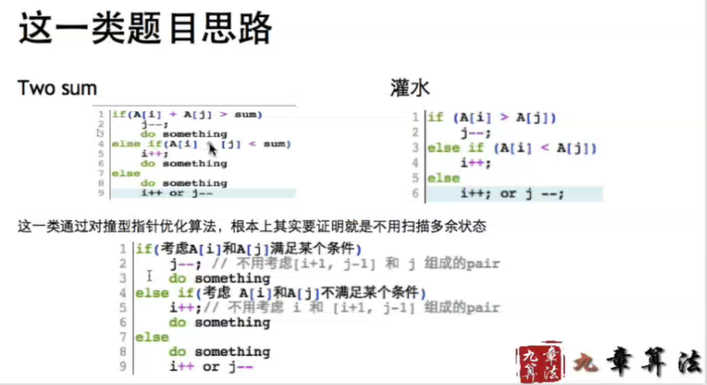
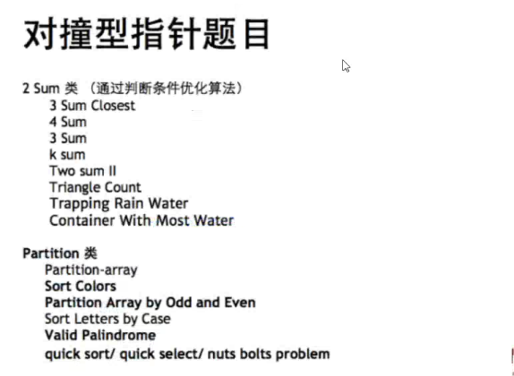
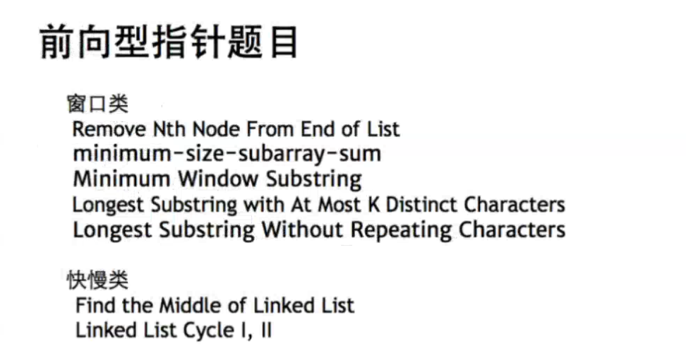

**Two Pointers**

* 相会/对撞型 (Help reduce $O(n^2)$ to $O(n)$)

  * 一个数组 & 两个指针在两端
  * Two Sum类（优化 O(n^2) -> O(n))
    * [Two Sum I, II](../FLAG-Followup/2Sum.md)
    * [Triangle Count](../FLAG-Followup/Lint. Triangle Count.md)
    * 灌水问题
      * [Trapping Rain Water I & II](../DataStructure-2/42. Trapping Rain Water.md)
      * [Container With Most Water](11. Container With Most Water.md)

  * Partition类（O(n) -> O(n))

      * Quick Sort (Partition)

      * Quick Select (Partition)

        [<=p] p [p>] - handle duplicated p element

          * [Kth Largest Element in an Array](215. Kth Largest Element in an Array.md)
          * [Wiggle Sort i & ii](Wiggle Sort.md) 
          * [Nuts & Bolts Problem (Follow up)](Lint. Nuts & Bolts Problem.md)
          * [Sort Colors I & II](75. Sort Colors.md)
          * [Sort Letters by Case](Lint. Sort Letters by Case.md)
          * [Partition Array by Odd and Even](Partition Array by Odd and Even.md)
          * [Partition Array](Partition Array.md)

* 前向/追击型

  * 一个数组 & 两个指针在同一端
  * **窗口类** （优化 O(n^2) -> O(n)) 
    * longest/minimum size
  * 快慢类 （O(n) -> O(n))
    * [Minimum Size Subarray Sum](209. Minimum Size Subarray Sum.md)
      * [Maximum Size Subarray Sum Equals k](https://leetcode.com/problems/maximum-size-subarray-sum-equals-k)
      * ​
    * [Longest Substring Without Repeating Characters](3. Longest Substring Without Repeating Characters.md)
    * [Minimum Window Substring](76. Minimum Window Substring.md)
    * [Longest Substring with At Most K Distinct Characters](Longest Substring with At Most K Distinct Characters.md)
    * ​

  

  * **Summary**
    * 优化思想通过两层for循环而来
    * 慢指针是依次遍历
    * 快指针证明是否需要回退(以不回退来优化O(n^2) - > O(n))

* 两个数组两个指针型 (可并行)

  * 两个数组 & 两个指针在同一端
  * [The Smallest Difference](Lint. The Smallest Difference.md)
  * ​

