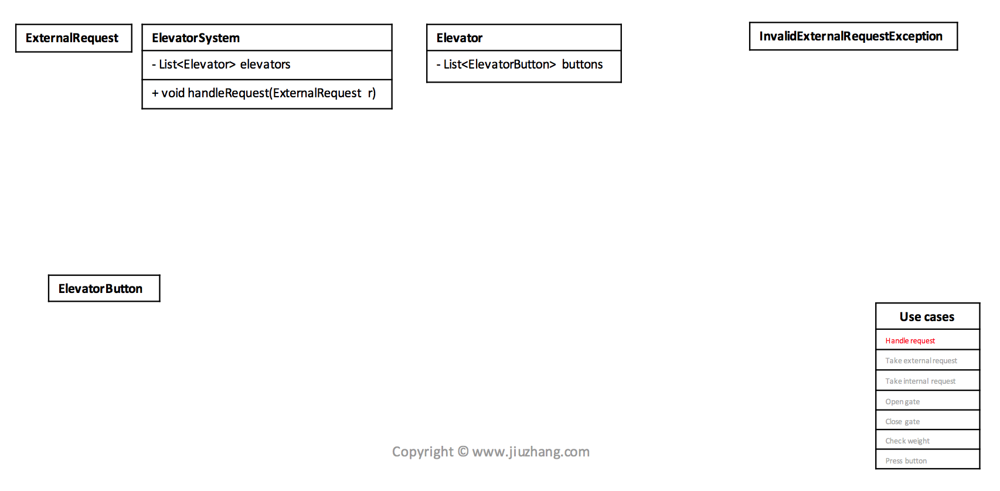

### Elevator System

题目：为一栋大楼设计电梯系统

- 不需要考虑超重的情况
- 该电梯系统目前只有1台电梯, 该楼共有`n`层
- 每台电梯有三种状态：上升，下降，空闲
- 当电梯往一个方向移动时，在电梯内无法按反向的楼层

我们提供了其他几个已经实现好的类，你只需要实现`Elevator Class`内的部分函数即可。

Example

```
5           // 电梯一共有5层
down(3)     // 发送第一个请求，会创建相应的request
up(1)       // 发送第二个请求，会创建相应的request
openGate() 
closeGate()
openGate()
closeGate()
```

// 注意每行命令之后我们都会调用`elevatorStatusDescription` 函数，用于测试你是否处于一个正确的状态。

你能看到的正确的内容应该是：

```java
-> down(3)
Currently elevator status is : DOWN.
Current level is at: 0.
up stop list looks like: [].
down stop list looks like:  [3].
*****************************************
-> up(1)
Currently elevator status is : DOWN.
Current level is at: 0.
up stop list looks like: [1].
down stop list looks like:  [3].
*****************************************
-> openGate()
Currently elevator status is : DOWN.
Current level is at: 3.
up stop list looks like: [1].
down stop list looks like:  [].
*****************************************
-> closeGate()
Currently elevator status is : UP.
Current level is at: 3.
up stop list looks like: [1].
down stop list looks like:  [].
*****************************************
-> openGate()
Currently elevator status is : UP.
Current level is at: 1.
up stop list looks like: [].
down stop list looks like:  [].
*****************************************
-> closeGate()
Currently elevator status is : IDLE.
Current level is at: 1.
up stop list looks like: [].
down stop list looks like:  [].
*****************************************
```


**Clarify** 

- What - nouns
  - Elevator 
    - 通用属性，对本题设计帮助不大
    - 每层楼不同：本题的所有电梯厢为相同规格
    - 种类不同：货梯，客梯，区别是什么
  - Building
    - 通过属性，对本题帮助不大（楼有多大／多高／能容纳多少人）
    - 是否有多处能搭乘的电梯口：本题只有一处电梯口，一台电梯
      - 当收到一个请求，多少电梯能够相应


- How - 没标准答案，提出一些解决方法，通过面试官的反应，选择一个比较有信心或简单的方案
  - 电梯的规则
    - 当按下按钮时，哪一台电梯会反应？同方向>静止>反方向？
      - **Q:** 假设现在有两台电梯，人在3层按了up的按钮，此时电梯a正在5层向上up的移动，电梯b则停在1层。这时候最好是不是由电梯b来响应request。但因为设置了这个优先级(同方向>静止>反方向)，所以会由电梯a来执行？
      - **A:** 我们的request里面有level和direction两个变量，在handleRequest的函数里你可以根据level和direction两个变量来选取具体哪一台电梯来响应～就像我昨天在课里说的，电梯选取的算法有很多种，你只要跟面试官描述一种就行了。另外还可以用我们昨天说的strategy pattern，这样什么选取电梯的方法都能即插即用～
    - 当电梯在运行时，哪些按键可以相应？是否能按下反向的楼层
  - 电梯的状态／信息
    - 三种状态 - 同向，静止，反向
    - 当前在哪一层
  - 电梯如何获取每位乘客的重量 
    - 电梯能够自动感应当前重量
    - Passenger class包含重量
- Who
  - 设计由人主导 vs 设计由系统主导
    - 站在系统的角度：input -> BLACK BOX -> output
  - **[Optional]** 通过思考题目当中是否有人的出现，来帮助确定解题范围
    - 考虑人的角色以及属性，看题目是否需要
- When
  - **[Optional]** 通过思考题目中与时间相关的属性，帮助确定解题范围


**Core Object**

* 为完成设计需要的类/class
* 和面试官初步的纸面contract
* 承上启下，clarify的结果，use case的依据，class diagram的基础


Request         ->     ElevatorSystem           ->          Elevator          ->       ElevatorButton

​                     -List<Elevator> elevators     -List<ElevatorButton> buttons

**GoodPractice** - **Access Modifier** (<u>VERY Important</u>)

* package NONE (variables & functions are package level visible)
* public + (variables & functions are public level visible)
* private - (variables & functions are class level visible)
* protected # (variables & functions are class & **subclass** level visible)


**Cases**

* Use case: 设计的系统需要支持的功能
* 和面试官达成的第二份共识，需将实现的功能列在白板上
* 理清条例，实现每个case，帮助检查
* How? 
  * 列出每个object对应产生的use case
  * 每个use case只需用一个简单的话描述
  * e.g.
    * ElevatorSystem - Handle Request
    * Elevator - Take External/Internal Request, Open/Close Gate, Check weight (**NOT** viloate single responsibility principle - that's an elevator should do)
    * ElevatorButton - Press Button


**Class Diagram**

- class name
- attributes (access modifier)
- functions (access modifier)
- Importance
  - 面试官: Minimal Viable Product
  - 在use case的基础上
  - save time
  - 便于转成code
- How?
  - 遍历所有的use case
  - 对每个use case，更加详细的描述这个use case做的事情
    - e.g.: take external request -> ElevatorSystem takes an external request, and decide to push this request to an appropriate elevator
  - 针对描述，在core objects填充对应的信息


**Use case**: Handle request


ElevatorSystem takes an external request, and decide to push this request to an appropriate elevator					


```java
ElevatorSystem sys = new ElevatorSystem();
sys.handleRequest(...);
```


**GoodPractice** - **Handle Exception**

地下一层电梯关闭，这时有人在地下一层按了向上的按钮，会发生什么？

如何知道一个函数，是否成功完成任务？

1. Use boolean instead of void
2. Use exceptions (还能知道哪里出错！)


**Use case**: Take external request


An elevator takes an external request, inserts in its stop list.

		
我们的request里面有level和direction两个变量，在handleRequest的函数里你可以根据level和direction两个变量来选取具体哪一台电梯来响应～就像我昨天在课里说的，电梯选取的算法有很多种，你只要跟面试官描述一种就行了。另外还可以用我们昨天说的strategy pattern，这样什么选取电梯的方法都能即插即用～


**Enumeration** vs **Class** with public static final field

1. Type safety and value safety.
2. Guaranteed singleton.
3. Ability to define and override methods.

[Good References in GeeksforGeeks](http://www.geeksforgeeks.org/enum-in-java/)

```java
enum Day
{
    SUNDAY, MONDAY, TUESDAY, WEDNESDAY,
    THURSDAY, FRIDAY, SATURDAY;
}
```

- **toString() method** is overridden in **java.lang.Enum class**,which returns <u>enum constant name</u>.

* **valueOf() method** returns the enum constant of the specified string value, if exists.
* Every enum constant is always implicitly **public static final**. (access: Day.SUNDAY)


**Challenge**:

如果电梯目前在1L，有人按下5L向下，而后有人按下3L向上，电梯如何处理这些external requests?

Expected is {3, 5} 

* Solution1: sort stops every time we add to it
* **Solution2**: use priority queue instead of list

如果电梯目前在1L，有人按下5L向下，而后有人按下3L向上，紧接着又有人按下2L向下，电梯如何处理同和反方向的request？

Expected is {3, 5, 2}

* Solution: keep 2 lists for different direction 
  * First handle the list with same direction as elevator


**Implementation**

```java
-> down(3): a person in the 3rd level requesting to go down.
Currently elevator status is : DOWN.
Current level is at: 0.
up stop list looks like: [].
down stop list looks like:  [3].
*****************************************
-> up(1): a person in the 1st level requesting to go up
Currently elevator status is : DOWN.
Current level is at: 0.
up stop list looks like: [1].
down stop list looks like:  [3].
*****************************************
public void handleExternalRequest(ExternalRequest r)
{
  // 1. add to stop list & sort list
  // 2. if idle, start the machine
  if (r.getDirection() == Direction.UP) {
    upStops.add(r.getLevel());
    Collections.sort(upStops);

    if (status == Status.IDLE) { // Start the machine
      status = Status.UP;
    }
  } else { // Direction.DOWN
    downStops.add(r.getLevel());
    Collections.sort(downStops, Collections.reverseOrder());

    if (status == Status.IDLE) { // Start the machine
      status = Status.DOWN;
    }
  }

}
```


**Use Case**: Take Internal Request

An elevator takes an internal request, determine if it’s valid, inserts in its stop list.

	

**Challenge**: 如何判断一个internal request是否为一个valid request？

**Solution**: 

* If elevator going up (**Status - up**)
  * Requesting level lower than current level is **invalid **(**Current level**)
* If elevator going down (**Status - down**)
  * Requesting level higher than current level is **invalid** (**Current level**)


**Use Case**: Open Gate

An elevator reaches the next stop, open gate


**Implementation**

```java
-> openGate()
Currently elevator status is : DOWN.
Current level is at: 3.
up stop list looks like: [1].
down stop list looks like:  [].
*****************************************
public void openGate() throws Exception
{ 
    // It depends how different the implementations of openGate/closeGate are.
    
    // update current Level
    // remove the 1st elem in stop list
    if (status == Status.UP && !upStops.isEmpty()) {
        currLevel = upStops.get(0);
        upStops.remove(0); // index
    } else if (status == Status.DOWN && !downStops.isEmpty()) {
        currLevel = downStops.get(0);
        downStops.remove(0);
    } 
}
```


**Use case**: Close Gate


An elevator (These things can also be done in <u>Open Gate</u>)

* checks if overweight; (overweight check)
* close the door;
* then check stops corresponds to current status; (one of stop list)
* if no stops left, check the reserve direction stops; (another stop list)
* change status to reserve direction or idle. (status)

**Implementation**

```java
-> closeGate()
Currently elevator status is : UP.
Current level is at: 3.
up stop list looks like: [1].
down stop list looks like:  [].
*****************************************
public void openGate() throws Exception
{ 
    // It depends how different the implementations of openGate/closeGate are.
    
	    // stop list check & update status
	    if (status == Status.UP) {
	        if (upStops.isEmpty()) {
	            if (downStops.isEmpty()) {
	                status = Status.IDLE;
	            } else {
	                status = Status.DOWN;
	            }
	        }
	    } else {
            if (downStops.isEmpty()) {
                if (upStops.isEmpty()) {
                    status = Status.IDLE;
                } else {
                    status = Status.UP;
                }
            }	         
	    }
}
```


**Use case**: check weight			


An elevator checks its current weight and compare with limit to see if overweight


**Use case**: press button

A button inside elevator is pressed, will <u>generate an internal request</u> and send to the elevator.


**Correctness**

* Validate use cases (检查是否支持所有的use case)
* Follow good practice (面试当中的加分项，展现一个程序员的经验)
* S.O.L.I.D principles
* Design pattern

**GoodPractice** - **Inheritance**

检查设计中，是否有重复的类，可采用继承的方式来表现


**Challenge**

- How do you handle an external request?
  - 多台电梯：
    - 我们的request里面有level和direction两个变量，在handleRequest的函数里你可以根据level和direction两个变量来选取具体哪一台电梯来响应～就像我昨天在课里说的，电梯选取的算法有很多种，你只要跟面试官描述一种就行了。另外还可以用我们昨天说的strategy pattern，这样什么选取电梯的方法都能即插即用～。
    - 同方向 > 静止 > 反向。but if an elevator goes in the same direction like up, but elevator.level > request.level，then this elevator is out of consideration, and we can consider the next elevator with highest priority.
  - 一台电梯：
    - Keep 2 list (upStops & downStops). 
    - Sort list whenever an external request add to it. upStops is sorted in the increasing order and downStops is sorted in reverse order
      - 2 priority queues. upStops is a min heap and downStops is a max heap
    - Handle the list with same direction first. 
- What if I want to apply **different ways to handle external requests** during different time of a day?
  - if-else - **BAD PRACTICE** - Violate Open-closed principle (Open to extend but close to modification)
  - strategy design pattern
    - 封装多种算法和策略，使得它们之间能互相替换


- Can you **implement** it in code?


​		

​				
​			
​		
​	


​			

​			
​		
​		


​	


​				
​				
​			
​		
​	


​	


​			
​		
​	


