###Parking Lot

Design a parking lot.

see CC150 OO Design for details.
1) `n` levels, each level has `m` rows of spots and each row has `k` spots. So each level has `m` x `k` spots.
2) The parking lot can park <u>motorcycles</u>, <u>cars</u> and <u>buses</u>
3) The parking lot has <u>motorcycle spots</u>, <u>compact spots</u>, and <u>large spots</u>
4) Each row, motorcycle spots id is in range `[0,k/4)(0 is included, k/4 is not included)`, compact spots id is in range `[k/4,k/4*3)` and large spots id is in range `[k/4*3,k)`.
5) A motorcycle can park in any spot
6) A car park in single compact spot or large spot
7) A bus can park in five large spots that are consecutive and within same row. it can not park in small spots


管理类 - 设计一个模拟/代替**管理员**日常工作的系统	

- Gym／Parking lot／Restaurant／Library／Super market／Hotel


**Clarify - What/How/Who/When**

* **What**
  * 题目中问的名词Parking lot
    * **Challenges(asked or ask)**: What are the differences between these parking lots?
      * **Single Level Parking Garage**: Parking lot -> Parking Spaces
      * **Multilevel Parking Garage**: Parking lot -> Parking Level -> Parking Spaces (Yes in this)
      * **Parking Garages with Upper and Lower Level Parking Spaces**: Parking lot -> Parking Level(**optional**) -> Parking Spaces -> Upper/Lower Space
  * 管理的名词Vehicle
    * Bus/Car/Motorcycle
  * 管理的名词Parking Spots
    * (asked or ask): Do we need to consider disabled parking spaces? (No in this)
    * **Challenges(asked or ask)**: Is there any difference among parking spaces?
      * All parking spaces have the standard size. (Yes in this)
      * Different sizes for different vehicles
        * need a lot of modificaitons if parking lot supports new vehicle models' parking
        * low utilization rate
* How - 停车场的规则
  * 如何停车 - 从停车场的角度出发:开进停车场 -> 返回一个能停的地方 -> 停进一个位置
  * 停车场可显示空闲位置的个数
  * Are spaces **free** or **pay** to park? - **Pay here**

**Core object -> 有进有出**

* Elevator System
  * Input: Request
  * Output: Elevator
* Parking Lot
  * Input: Vehicles (Bus/Car/Motorcycle)
  * Output: Parking Spot

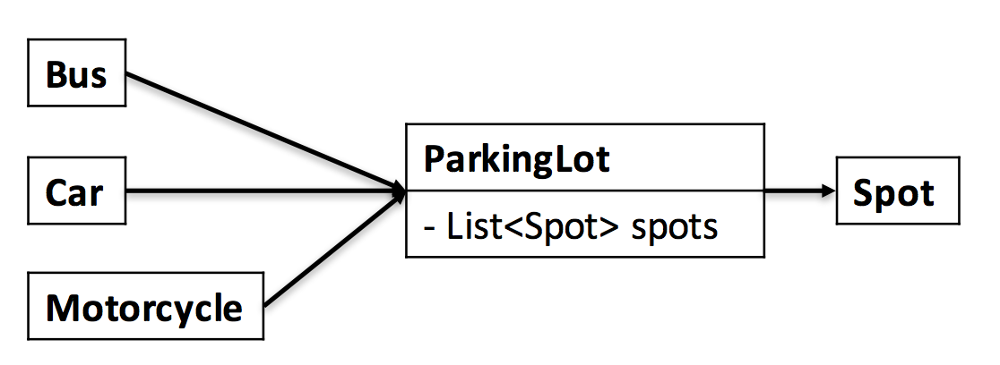

```markdown
Bad design for association between car and parking lot is dynamic. 
Not good! Better for static relationship
Also bad for association between car and spot…
Single responsibility principle
```

**Use Case**

* 管理员角度
  * Reserve: x
  * Serve: park vehicle
  * Checkout: clear spot + caculate price

* CoreObject角度

  * Bus / Car / Motorcycle - N/A

  * Spot - N/A

  * ParkingLot

    * Get available count
      * Parking lot shows how many available spots in total
        * 如何分别显示出每一层的空位个数
          * Solution 1: 有几层就保存几个变量（open to extension but closed to modification）
          * Solution 2: 新建一个Level类

    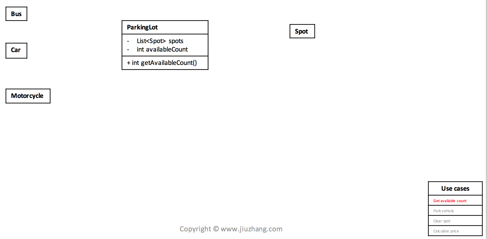

    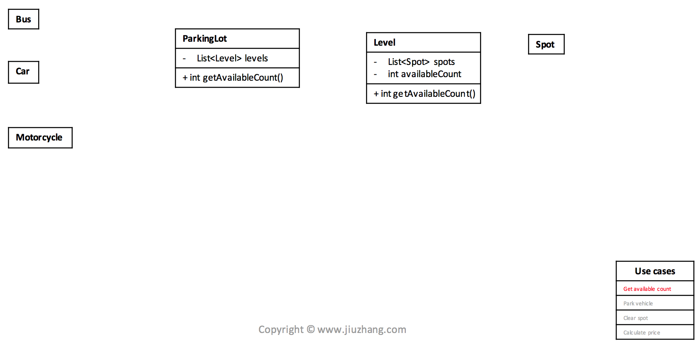

    * Park vehicle
      * Parking lot checks the size of vehicle

    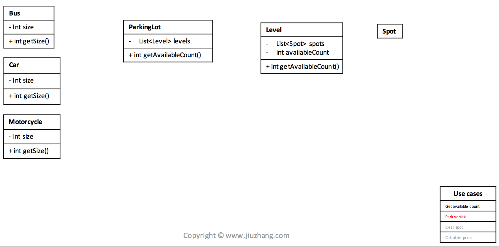

    ​         * Parking lot find an available spot for this vehicle

    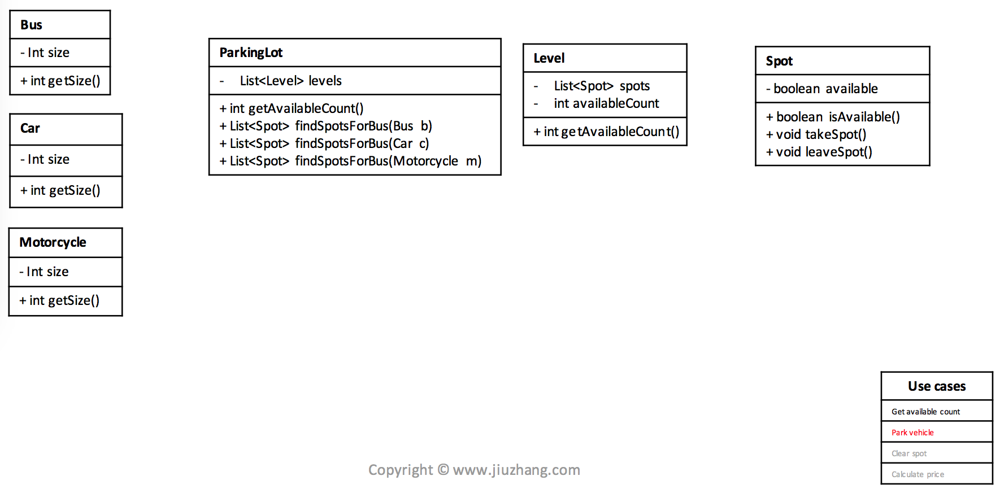

    **Best Practice - Open to extension closed to modification**

    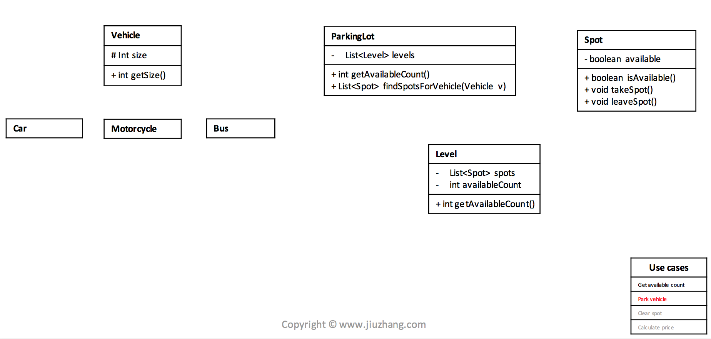

    ​	   * Vehicle takes the spot(s) (As above)

    * Clear spot 
      * Parking lot find the spot to clear
      * Update spot to be available
      * Update available count for each level

    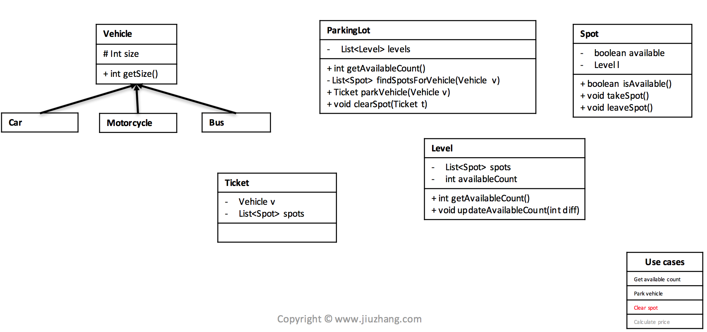

    * Calculate price
      * When clear spot, parking lot calculates the expected price to pay

    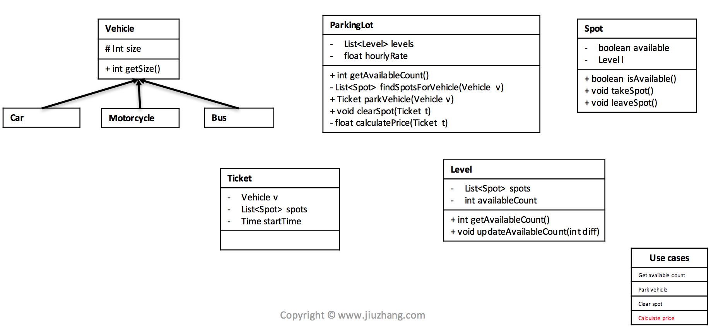

**Class Diagram** 

* 经常可使用收据的形式，以保管信息
  * Library: User - Receipt - Book
  * Parking Lot: User - Receipt - Vehicle
* Final View as above

  **Correctness**		

- Validate use cases (检查是否支持所有的use case)
- Follow good practice (面试当中的加分项，展现一个程序员的经验)
- S.O.L.I.D
  - Design pattern


**Challenges (asked or ask)**

Parking lot里每层的spots，是怎么排列的?当停Bus时，是否有问题?

* Solution 1
  * 在Level里加一个变量，作为每行固定的停车位个数
  * 在Spot里加一个变量，作为Spot Id
  * 这样能够知道哪些Spot在一行 / 一行有没有足够的Spots
    * [**Weakness**] 如果用Solution 1, 每行的个数必须要一样
* Solution 2
  * 像添加Level一样，添加一个Row作为新的Class

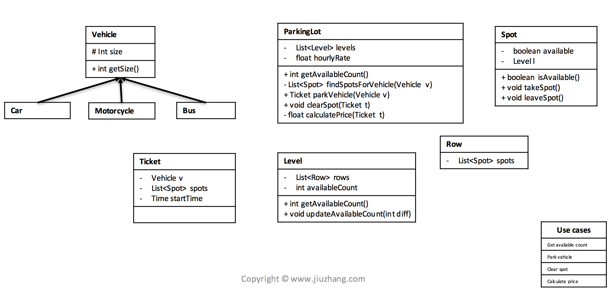


**Exception**

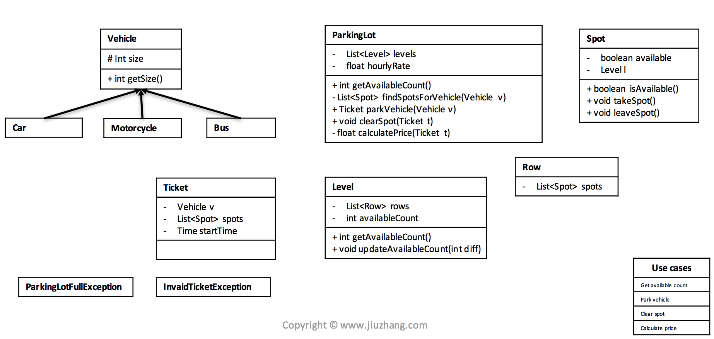

* ParkingLotFullException - parkVehicle
* InvalidTicketException - clearSpot


**Design Pattern**

* Clean and elegant
* Keep code extendable
* Safe
* Show off your skills!

**Singleton**

* Ensure a class has only one instance, and provide a global point of access to it

1. 基本式 - lazy initialization & not thread safe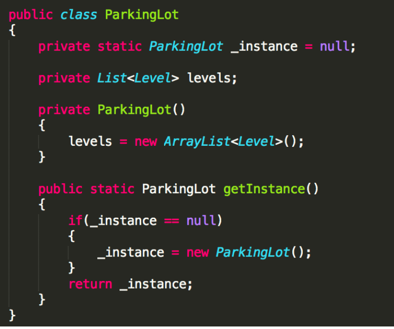
2. 线程安全式 - lazy initialization & thread safe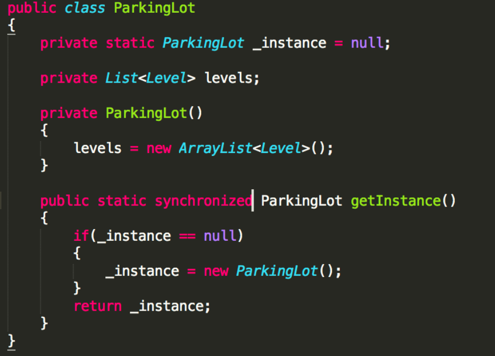
3. 静态内部类式 eager initialization & thread safe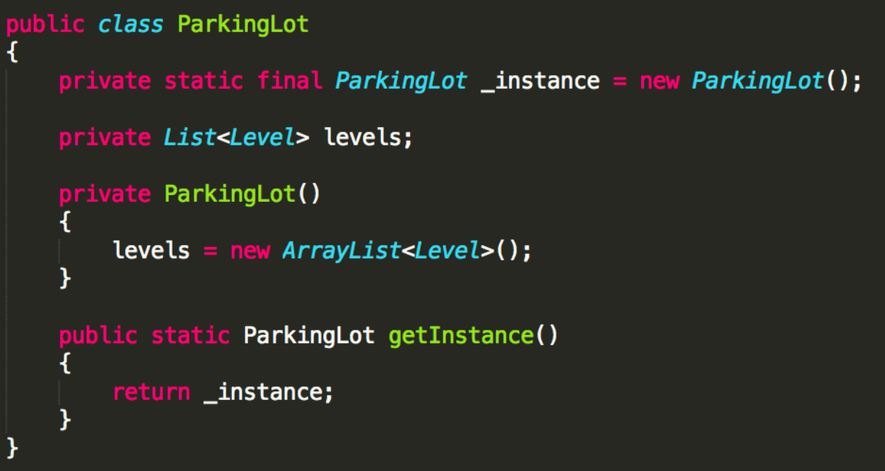

[**Weakness**] Singleton classes are created for resources such as File System, Database connections etc and we should avoid the instantiation until unless client calls the `getInstance` method. Also this method doesn’t provide any options for exception handling.

[**Benefit**] Thread safe