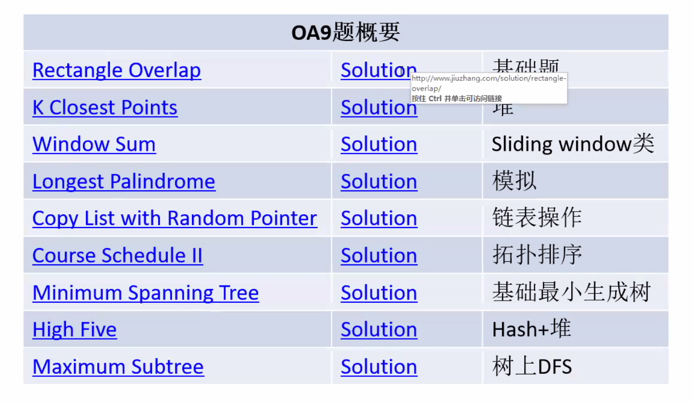

**sCoding Questions:**

**OA2**

* [High Five Scores](High Five Scores.md)
* [Two Sum Closest](Two Sum Closest.md)

**OA**

* [Valid Parentheses](../Stack_Queue/Valid Parentheses.md)
* [LCA 变形](../BinaryTree/236. Lowest Common Ancestor of a Binary Tree.md)
* [Find All Anagrams in a String/Substring Anagrams](../Linear-Structure/Substring Anagrams.md).
* [朋友圈](../DataStructure-1/朋友圈.md)
* [Movie Network: BFS + minHeap](../Graph/Movie Network.md)
* [Baseball](../Stack_Queue/Baseball.md)

**OA - High 9**

* [High Five Scores](High Five Scores.md)
* [Rectangle Overlap](Rectangle Overlap.md)
* [Minimum Spanning Tree](../Graph/Minimum Spanning Tree.md)
* [Longest Palindrome Substring](Longest Palindrome Substring.md)
* [Longest Palindrome](../Linear-Structure/Longest Palindrome.md)
* [Course Scheduler I & II](../Graph/Course Scheduler.md)
* [Maximum Subtree](../BinaryTree/Maximum Subtree.md)
* [K Closest Points](K Closest Points.md)

